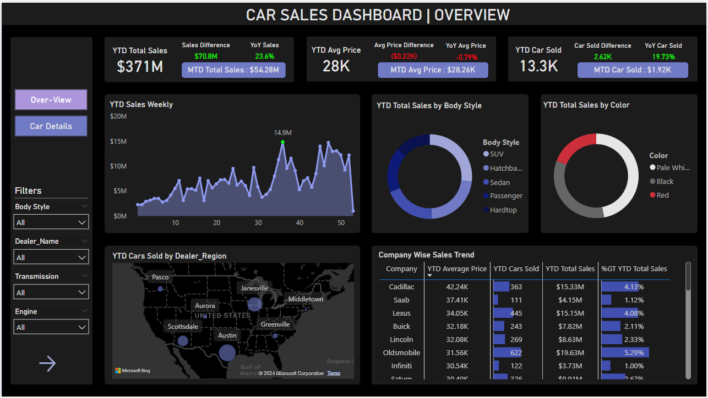
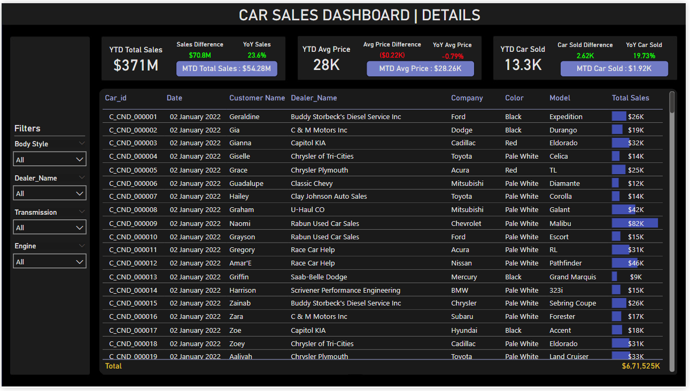

# Automotive-Sales-Performance-Analytics

## Overview
This project analyzes car sales data to uncover market trends, sales distribution, and competitive benchmarks. The analysis focuses on year-to-date (YTD) and month-to-date (MTD) metrics, providing actionable insights into the automotive market's performance.

## Dashboard

## Key Features

1. **Data Cleaning and Preparation**  
   - Processed raw sales data using **Excel**, addressing **outliers**, **missing values**, and **unwanted entries**.  
   - Ensured accuracy in calculating **YTD sales**, **MTD metrics**, and other key performance indicators.

2. **Market Insights and Visualization**  
   - Analyzed **YTD sales trends**, noting a **23.6% YoY increase**.  
   - Visualized key insights using **pie charts**, **donut charts**, **area charts**, and **maps**, highlighting sales by product type and geography.  
   - Identified weekly peaks in sales, with the maximum reaching **14.9M units sold**.

3. **Competitive Benchmarking**  
   - Highlighted **Chevrolet's leadership** in the market, leading **YTD total sales by 7.3%** over competitors.  
   - Provided insights into **YTD average prices** and **total sales** to analyze competitive positioning and market dynamics.

## Tools and Techniques
- **Data Cleaning**: Excel.  
- **Data Visualization**: Pie charts, donut charts, area charts, maps.  
- **Key Metrics**: YTD sales, MTD metrics, YoY growth, competitive analysis.

## Insights
- Sales grew significantly, with Chevrolet emerging as the top performer in **YTD total sales**.  
- Weekly trends indicate consistent sales performance, with notable peaks during specific periods.  
- Visual analysis of sales by geography and product type reveals growth opportunities in untapped markets.

## Future Scope
- Expand analysis to include customer demographics and preferences.  
- Incorporate machine learning models for sales forecasting.  
- Assess the impact of promotional strategies on regional sales performance.